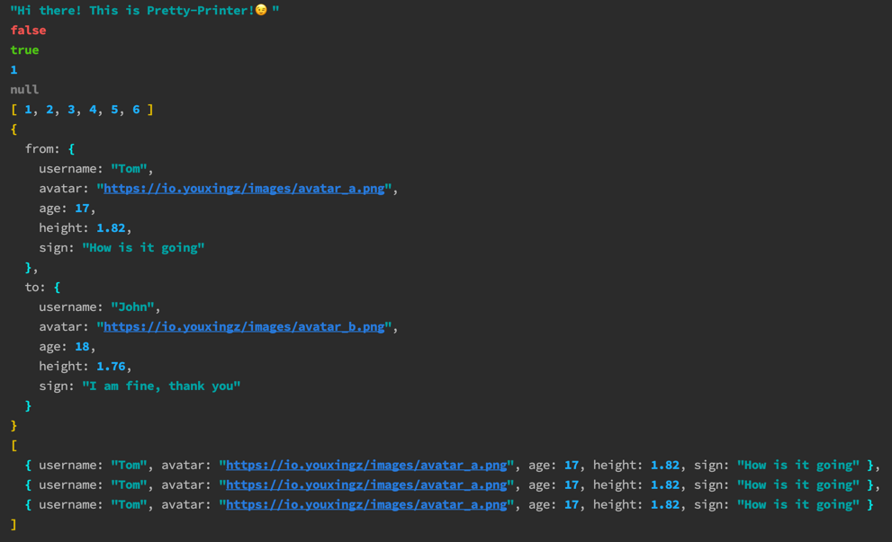

## Pretty Printer

Now! You can print anything in Java!

- [x] colorful printer
- [x] brackets of different depths have different colors
- [x] support date format
- [x] support plain object with getter/setter
- [ ] ...

### Sample

```java
// string:
Pretty.print("Hi there! This is Pretty-Printer!😉");
// boolean:
Pretty.print(false);
Pretty.print(true);
// number:
Pretty.print(1);
// null:
Pretty.print(null);
// list:
Pretty.print(Arrays.asList(1, 2, 3, 4, 5, 6));
// object:
User tom = new User("Tom", "https://io.youxingz/images/avatar_a.png", 17, 1.82f, "How is it going");
User john = new User("John", "https://io.youxingz/images/avatar_b.png", 18, 1.76f, "I am fine, thank you");
Friend friend = new Friend(tom, john);
Pretty.print(friend);
// list of objects:
Pretty.print(Arrays.asList(tom, tom, tom));
```
Console output:



### Installation

#### [Maven Dependency](https://github.com/youxingz/pretty-printer/packages/1679687)

```xml
<dependency>
    <groupId>io.pretty</groupId>
    <artifactId>pretty-printer</artifactId>
    <version>1.0-SNAPSHOT</version>
</dependency>
```
